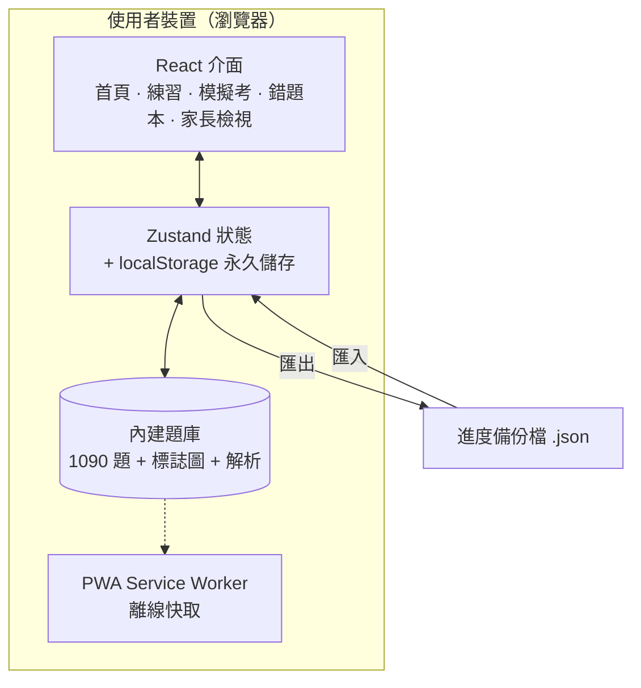

# 汽車駕照筆試通 2026 — 設計說明

> 產品與技術架構導覽。針對台灣 **2026 新制**汽車駕照筆試（全 50 題選擇題、含危險感知／情境題）。

## 這是什麼

一個**手機優先**的駕照筆試練習 App：免登入、免安裝、可離線，所有資料只存在你自己的裝置。專為「利用零碎時間、短期內準備」而設計。

- **1,090 題**官方題庫（交通部公路局 115.06.09 版）
- **157 張**官方標誌／圖示（139 張題目附圖＋18 張選項標誌）
- **1,090 條**題目解析（每題都有）

## 設計理念

| 原則 | 做法 |
|---|---|
| 手機優先 | 大按鈕、單手可用、底部導覽 |
| 零碎時間 | 每次練習隨開隨停，不綁時長 |
| 離線可用 | PWA，加到主畫面即像原生 App |
| 隱私優先 | 無帳號、無伺服器，資料只存本機瀏覽器 |
| 安全預設 | 破壞性動作可復原（匯出／匯入備份），**沒有一鍵清空** |

## 功能架構

| 功能 | 說明 |
|---|---|
| 🏠 首頁儀表板 | 考試倒數、今日目標、待複習、題庫涵蓋率、近期成績 |
| ✏️ 分類練習 | 交通標誌／交通規則／情境防禦／危險感知，另有待複習、錯題練習 |
| 📝 模擬考 | 50 題仿新制，交卷計分，記錄錯題與不確定題 |
| 📒 錯題本 | 間隔複習：當天 → 隔天 → 3 天 → 7 天 → 精熟 |
| 🔍 搜尋 | 用關鍵字找題目、選項、解析 |
| 👨‍👩‍👧 家長檢視 | 涵蓋率、近 7 天練習量、各題型正確率、弱點分析 |
| ⚙️ 設定與備份 | 考試日期、每日目標、及格分數、匯出／匯入進度 |

## 技術架構

- **前端：** Vite + React + TypeScript + Tailwind CSS
- **狀態與儲存：** Zustand + localStorage（本機永久化）
- **PWA：** vite-plugin-pwa（manifest + Service Worker，離線快取題庫與標誌圖）
- **部署：** GitHub Actions 自動建置 → GitHub Pages

## 資料模型

**題目（Question）**— 內建於題庫，可匯入更新：

`id · category · topic · question · options[] · answer（0 起算索引） · explanation · source · image / optionImages`

**進度（Progress）**— 只存本機，依題目 id 記錄，永不隨題庫更新而遺失：

`mistakeCount · correctCount · confidence · lastSeen · nextReview · srsStage`

**間隔複習規則：** 答錯 → 當天再現；之後每次答對逐級推進 **當天 → +1 天 → +3 天 → +7 天 → 精熟畢業**。

## 題庫與品質

- 題庫來源：**交通部公路局 115.06.09 版**（2026 新制）。
- 答案正確性：以官方 PDF 內「答案」欄位為地面真相，**全 1,090 題 100% 吻合**。
- 解析：官方 300 條 + 補寫 790 條；法規數字皆取自題目本身，不外加。

## 資料安全與備份

- 所有資料**只存在本機瀏覽器**，不上傳、免登入。
- **匯出／匯入進度**：一鍵下載 JSON 備份；換機或清除前可備份還原。
- **沒有「清空全部」按鈕**；「清除作答進度」為兩段式確認，且建議先備份。

## 未來規劃（考後）

重構為**多人／多裝置版本 + 輕量後端**：帳號、雲端同步、家長遠端檢視。現版本刻意維持本機單人、零維運、最大隱私——先把眼前的考試準備顧好。
